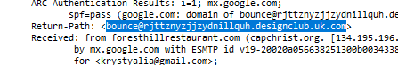
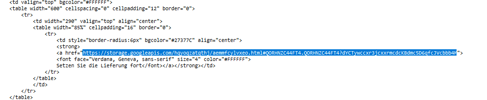
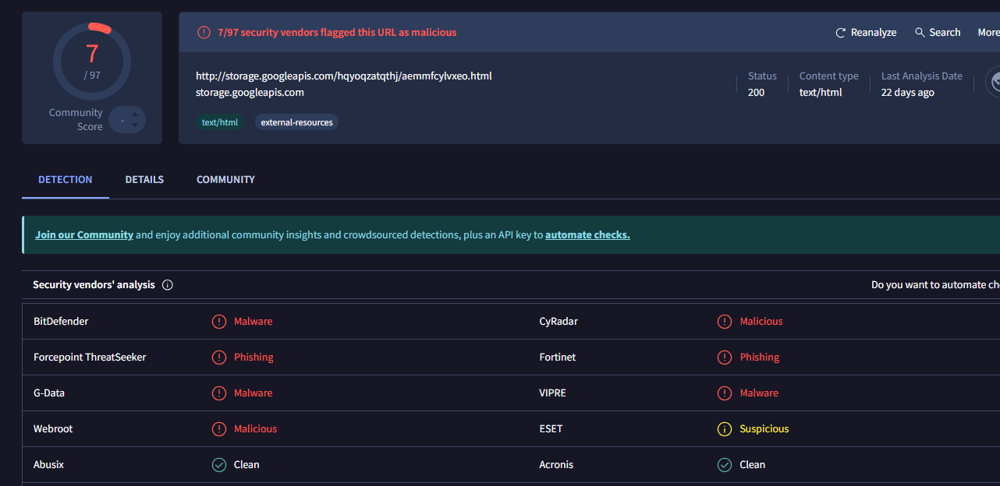
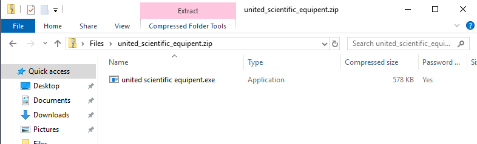
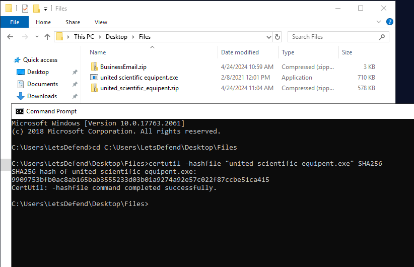
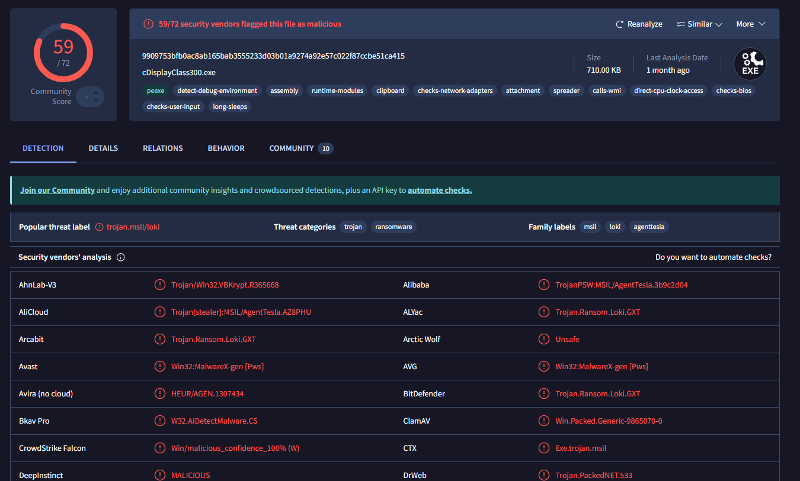
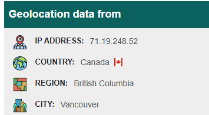

# Phishing Email Investigation Playbook

## Introduction  
This playbook guides SOC analysts through a structured investigation of phishing emails, covering header analysis, link inspection, attachment behavior, IOC extraction, and response recommendations. It is based on real-world phishing cases, including spoofed senders and malicious attachments.

---

## 1. Email Header Analysis  
**Goal:** Identify spoofed senders, suspicious return-paths, and anomalies indicating phishing.

### Step 1.1: Extract Email Headers  
- Use email client or tools like Email Header Analyzer, or open `.eml` in a text editor.

### Step 1.2: Analyze Key Fields  
- **Return-Path:** Check if domain matches the sender or legitimate organization.  
- **From:** Look for display name spoofing or mismatched email addresses.  
- **Received:** Trace email servers to check legitimacy and email path.  
- **SPF/DKIM/DMARC:** Verify if email passed authentication.

### Example from German PayPal Phishing  
- Return-Path domain `designclub.uk.com` unrelated to PayPal.
  
    
- Randomized subdomain `rjttznyzjzjydnillquh` signals mass phishing.  
- **Conclusion:** Likely spoofed sender.

---

## 2. Link Review and Analysis  
**Goal:** Identify malicious links, obfuscation, and hosts used for phishing pages.

### Step 2.1: Extract Links  
- View email HTML source or hover on links to view URLs.  
- Use tools or scripts to decode obfuscated or base64-encoded links.

### Step 2.2: Analyze Link Reputation  
- Submit URLs to VirusTotal, URLscan, or similar services for reputation and threat intelligence.  
- Look for known malicious indicators or phishing flags.

### Example from German PayPal Phishing  
- Obfuscated link decoded to `storage.googleapis.com/hqyoqzatqthj/aemmfcylvxeo.html`.
    
- VirusTotal flagged hosted object as phishing content.
    
- Although the domain is legitimate Google Cloud Storage, attackers abuse such services.

---

## 3. Attachment Analysis  
**Goal:** Safely extract and analyze email attachments for malicious content.

### Step 3.1: Identify Attachments  
- Check for attached files like `.zip`, `.exe`, `.docm`, etc.  
- Note suspicious filenames or typos that could indicate phishing.

### Step 3.2: Extract and Inspect  
- Extract compressed files in a safe sandbox or isolated environment.  
- Analyze executables or scripts with antivirus, hash lookup, or sandbox tools.

### Example from United Scientific Equipment Phishing  
- ZIP attachment `united_scientific_equipent.zip` contained `.exe` with typo in name (`equipent`).
    
- The `.exe` file’s SHA-256 hash was generated using `certutil` command.
     
- VirusTotal flagged the hash as malware.
    

---

## 4. IOC Extraction and Enrichment  
**Goal:** Compile and enrich indicators of compromise (IOCs) like IPs, domains, URLs, and hashes.

### Step 4.1: Collect IOCs  
- Extract suspicious IP addresses from headers or email routing info.  
- Extract domains and URLs from links or email metadata.  
- Extract file hashes (MD5, SHA-1, SHA-256) of suspicious attachments.

### Step 4.2: Enrich IOCs  
- Submit IPs, domains, URLs, and hashes to VirusTotal, AbuseIPDB, URLscan, or similar services.  
- Document reputation results, geolocation, and related threat reports.

### Examples from Both Cases  
- German PayPal phishing: malicious URL on Google Cloud Storage flagged by VirusTotal.  
- United Scientific phishing: IP `71.19.248.52` traced to Canada, suspicious for Singapore company email.
    
- Attachment hash flagged as malware by multiple antivirus engines.

---

## 5. Final Verdict and Response Actions  
**Goal:** Decide on phishing legitimacy and recommend appropriate incident response.

### Step 5.1: Summarize Findings  
- Confirm spoofed senders, malicious links, or attachments.  
- Highlight suspicious domains, IPs, or hashes.

### Step 5.2: Verdict  
- Declare if the email is a phishing attempt based on evidence.

### Step 5.3: Response Recommendations  
- Block malicious URLs and IPs in email gateway and firewall.  
- Quarantine or delete suspicious emails and attachments.  
- Alert users about the phishing campaign.  
- Update detection rules and share IOCs with relevant teams.  
- Monitor for related activity on network and endpoints.

### Examples  
- Both cases confirmed phishing attempts.  
- Indicators include spoofed domains, obfuscated URLs, malware-laced attachments, and suspicious IP geolocation.

---
